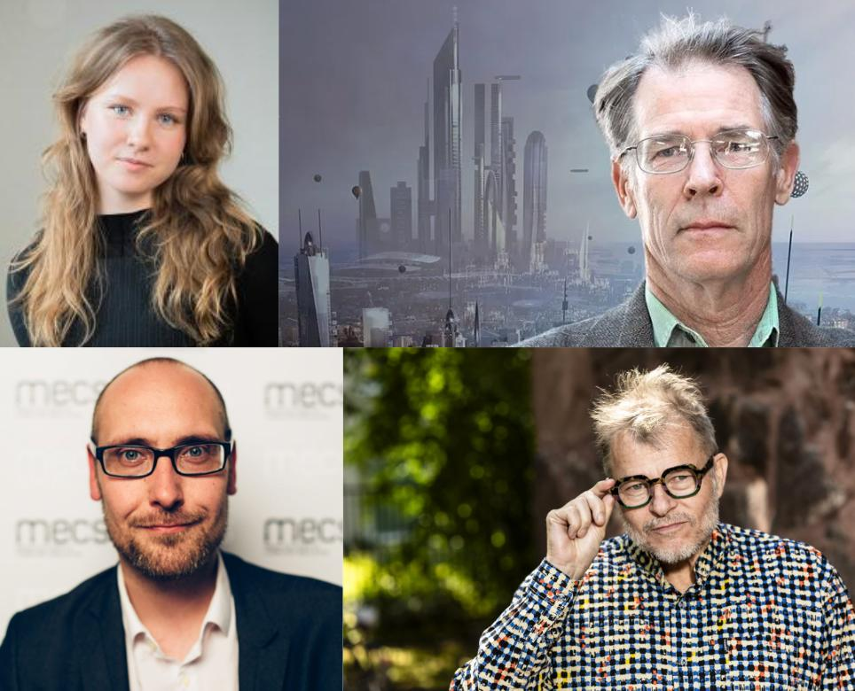

# Raportin julkistustilaisuus Käänne-festivaaleilla

Kuvat: Henri Salonen

### **Raportti julkistettiin Käänne-festivaaleilla Helsingissä**

_Ohjelmoitavan talouden kasvu_ -raportti julkaistiin [**Käänne-festivaaleilla**](https://kaannefestival.fi/conference-event/akseli-virtanen-talous-on-medium/), jotka järjestettiin Helsingin **Kulttuuritehdas Korjaamolla** 17.–18. tammikuuta 2026. Festivaali on maksuton politiikan, talouden ja kulttuurin tapahtuma, joka kokoaa yhteen muutosvoimaisia ääniä ja ideoita.&#x20;

Tilaisuus oli pakkautunut täyteen kiinnostunutta yleisöä ja tunnelma oli sähköinen. Raportin esitteli [**Akseli Virtanen**](https://hackmd.io/@econaut6/S1GEgoSLY), joka tiivisti puheenvuorossaan raportin keskeisen näkemyksen: nykyinen talous ei ole vain järjestelmä, jota säännellään ja mitataan, vaan se on media – väline, jonka kautta arvoja ilmaistaan, suhteita rakennetaan ja yhteistä elämää organisoidaan.&#x20;

<figure><figcaption></figcaption></figure>

Akseli haastoi perinteisen talousajattelun käyttökelpoisuuden tässä hetkessä. Hän esitti kysymyksen, vastaako se enää digitaalisen ajan todellisia rakenteita ja tarpeita. Raportissa esitetään, että digitalisaation, reaaliaikaisen laskennan ja tekoälyn murroksessa talouden “käyttöjärjestelmä” – sen säännöt, laskennan logiikka ja rakenteet – on päivitettävä vastaamaan uudenlaista ohjelmoitavaa ympäristöä. Raportin mukaan juuri tämä paradigman muutos avaa talouden kasvulle kokonaan uusia mahdollisuuksia, kun kasvua tarkastellaan ohjelmoitavuuden näkökulmasta ja sen tarjoamien luovien mahdollisuuksien kautta.&#x20;

Lisäksi kuultiin neljä kommenttipuheenvuoroa, jotka avasivat raportin teemoja uusista kulmista. Mukana olivat kirjailija [**Kim Stanley Robinson**](https://ecsa.io/files/comment_kim_stanley_robinson.m4a), politiikan professori [**Teivo Teivainen**](https://ecsa.io/files/comment_teivo.mp3), digitaalisen kulttuurin ja median professori [**Jussi Parikka** ](https://ecsa.io/files/comment_audio_jussi_parikka.m4a)sekä Operaatio Arktiksen [**Anni Pokela**](https://ecsa.io/files/comment_anni_poikela.mp3). Koko esitys sekä puheenvuorot ovat verkossa kuunneltavissa.

Tilaisuuden päätyttyä osallistujat jatkoivat [**Sculpting Economies**](https://kaannefestival.fi/conference-event/sculpting-economies-an-economic-media-lab/) -työpajaan, jossa Economic Space Agencyn Martin Born ja Pekko Koskinen fasilitoivat keskustelua ja harjoituksia talouksien muotoilusta. Työpaja tarjosi konkreettisia lähestymistapoja taloudellisten rakenteiden ja sääntöjen hahmottamiseen ja suunnitteluun sellaisina kuin ne voivat ilmetä tulevaisuuden ohjelmoitavassa taloudessa.

Käänne-festivaalin moniääninen ohjelma tarjosi taustaa raportin julkistukselle: Tapahtuma on osa laajempaa pyrkimystä rakentaa avoin ja erilaisia näkökulmia yhdistävä areena, jossa tulevaisuutta lähestytään politiikan, kulttuurin, taiteen ja yhteiskunnallisen liikehdinnän rajapinnoilla.

***

[**Julkistustilaisuuden taltiointi**](https://ecsa.io/files/EconomicSpaceAgency_TalousOnMedium_K%C3%A4%C3%A4nne_20260118_Audio.mp3)

**Kommenttipuheenvuorot**

<figure><figcaption></figcaption></figure>

[Anni Pokela](https://ecsa.io/files/comment_anni_poikela.mp3) | [Jussi Parikka](https://ecsa.io/files/comment_audio_jussi_parikka.m4a) | [Kim Stanley Robinson](https://ecsa.io/files/comment_kim_stanley_robinson.m4a) | [Teivo Teivainen](https://ecsa.io/files/comment_teivo.mp3)&#x20;

***

<figure><figcaption></figcaption></figure>

<figure><figcaption></figcaption></figure>

 (1).jpeg>) 
